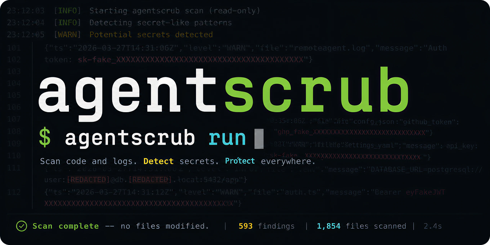
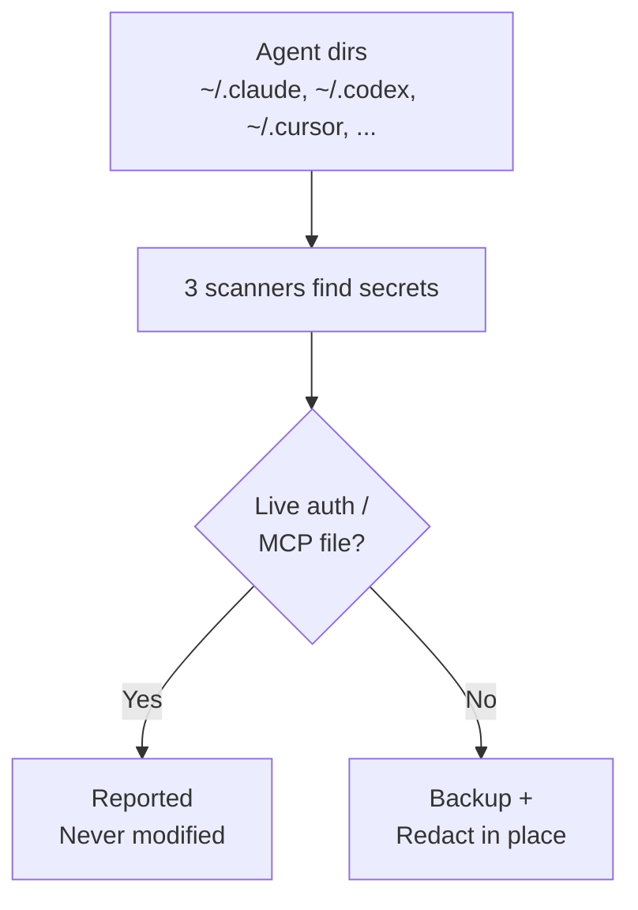

# agentscrub



**Clean the secrets your AI coding agents leave behind.**

agentscrub is an open-source, local-first CLI for finding and redacting leaked secrets in AI coding-agent histories, transcripts, tool-call logs, command traces, caches, and local state files.

AI tools like Claude Code, Codex CLI, Cursor, Gemini CLI, Windsurf, Cline, Continue, and others can store sensitive data locally: pasted API keys, `.env` contents, database URLs, JWTs, OAuth tokens, cloud credentials, MCP settings, and shell output. Malware, rogue extensions, compromised packages, or anyone with local machine access can scan those files for credentials. agentscrub scans locally, reports masked findings, and can safely redact leaked copies with backups and rollback.

https://github.com/user-attachments/assets/d75d2680-8363-4a89-b0f1-e48490015220

## Quick start

```bash
# Install
pipx install agentscrub

# Install the three detectors (gitleaks, TruffleHog, Titus). See "Detection tools"
# below for macOS / Windows / arm64 builds.
agentscrub doctor      # tells you what's missing

# Read-only audit — writes nothing; produces two masked reports
agentscrub scan

# Redact in place — asks for confirmation, takes a backup first
agentscrub run

# Cron-friendly: backup + redact daily at 03:00
agentscrub schedule install
```

## Safety model

- `scan` is **read-only**. It never modifies a file. Use it to see what's exposed.
- `run` writes a **timestamped backup** of every affected directory before touching anything. Restore with `agentscrub rollback`.
- **Live auth and MCP credential stores are preserved by design** — files like `~/.claude/.credentials.json`, `~/.codex/auth.json`, `~/.gemini/oauth_creds.json`, `cline_mcp_settings.json`, and the Windsurf / OpenCode / Crush / Continue config files are scanned and reported but never modified. [Full list below](#live-auth--mcp-files-preserved-scanned-reported-never-modified).
- **Raw secrets are never printed in reports.** Each match gets a stable proof hash so you can correlate the same secret across files without exposing it.
- All scanners run **locally**. Nothing leaves your machine.

## How it works



## What it covers

All tools are **auto-detected** — no configuration required. Each row lists every
folder agentscrub recognises across Linux, macOS, and Windows; the first one
that exists on your machine is scanned. Plain-text logs, JSONL sessions, and
JSON state files are scrubbed in place; SQLite databases (`.sqlite`, `.db`,
`.vscdb`) are scrubbed via SQL UPDATE on text columns containing detected
secrets.

| Tool | Where session/log data lives | Notes |
|---|---|---|
| Claude Code | `~/.claude/` | JSONL sessions, file-history snapshots, project trees |
| OpenAI Codex CLI | `~/.codex/` | `sessions/`, `history.jsonl`, `logs_*.sqlite`, `state_*.sqlite` |
| Cursor (CLI/IDE) | `~/.cursor/` | `projects/` (IDE chats), `chats/` (CLI), `acp-sessions/`, `logs/` |
| Cursor (server) | `~/.cursor-server/` | remote-dev / SSH server-side trees |
| Cursor (desktop) | `~/Library/Application Support/Cursor/User/workspaceStorage/`, `~/.config/Cursor/User/workspaceStorage/`, `~/AppData/Roaming/Cursor/User/workspaceStorage/` | chats live in `state.vscdb` (SQLite) |
| Google Antigravity | `~/.antigravity-server/` | server-side IDE state |
| Windsurf | `~/.codeium/windsurf/` (XDG canonical), `~/.config/Codeium/Windsurf/`, `~/AppData/Roaming/Codeium/Windsurf/`, `~/.windsurf/` | Cascade conversation history |
| Windsurf (server) | `~/.windsurf-server/` | remote-dev / SSH server-side trees |
| Windsurf (desktop) | `~/Library/Application Support/Windsurf/User/workspaceStorage/`, `~/.config/Windsurf/User/workspaceStorage/`, `~/AppData/Roaming/Windsurf/User/workspaceStorage/` | desktop IDE workspaceStorage |
| Gemini CLI | `~/.gemini/` | `tmp/<project_hash>/chats/`, plus the Antigravity `brain/`, `skills/`, `commands/` trees |
| Zed AI | `~/.local/share/zed/`, `~/Library/Application Support/Zed/`, `~/AppData/Roaming/Zed/`, legacy `~/.config/zed/conversations/` | conversation history in `threads/threads.db` (SQLite) |
| OpenCode | `~/.local/share/opencode/` (state, sessions) and `~/.config/opencode/` (config) | state/session data plus global config |
| Crush (Charm) | `~/.local/share/crush/` (state, logs) and `~/.config/crush/` (config) | per-workspace `.crush/` state, `crush.log` |
| Cline | VS Code `globalStorage/saoudrizwan.claude-dev/` (cross-OS) **or** `~/.cline/data/` (CLI mode) | `tasks/<id>/`, `state/`, `checkpoints/` |
| GitHub Copilot Chat | `Code/User/workspaceStorage/*/GitHub.copilot-chat/` (cross-OS, scoped to the Copilot extension only) | `chatSessions/`, `transcripts/`, plus `state.vscdb` chat data |
| Aider | `~/.aider/` | repo-local `.aider.input.history` / `.aider.chat.history.md` are out of scope — pass them with `--also <path>` |
| Continue | `~/.continue/` | CLI sessions in `~/.continue/sessions/` |

### Live auth & MCP files preserved (scanned, reported, **never modified**)

`agentscrub run` will not write to any of the following — they're the live
credentials your agent needs to keep working. They're still scanned and any
matched patterns are reported, so you can review them by hand if needed.

| Tool | Preserved file(s) |
|---|---|
| Claude Code | `~/.claude/.credentials.json`, `~/.claude/settings.json`, `~/.claude.json` |
| Codex CLI | `~/.codex/auth.json`, `~/.codex/.credentials.json`, `~/.codex/config.toml` |
| Cursor | `~/.cursor/mcp.json` |
| Windsurf | `~/.codeium/windsurf/mcp_config.json`, `~/.codeium/mcp_config.json`, `~/.config/Codeium/Windsurf/mcp_config.json`, `~/.windsurf/mcp.json`, `~/.windsurf/mcp_config.json` |
| Gemini CLI | `~/.gemini/oauth_creds.json`, `~/.gemini/mcp-oauth-tokens.json`, `~/.gemini/settings.json`, `~/.gemini/google_accounts.json`, `~/.gemini/trustedFolders.json`, `~/.gemini/installation_id`, `~/.gemini/user_id`, `~/.gemini/antigravity/mcp_config.json` |
| OpenCode | `~/.local/share/opencode/auth.json`, `~/.local/share/opencode/mcp-auth.json`, `~/.config/opencode/opencode.{json,jsonc}`, `~/.config/opencode/tui.{json,jsonc}` |
| Crush | `~/.local/share/crush/mcp.json`, `~/.local/share/crush/crush.json`, `~/.config/crush/crush.json` |
| Aider | `~/.aider.conf.yml` |
| Continue | `~/.continue/config.yaml`, `~/.continue/config.json`, `~/.continue/config.ts`, `~/.continue/.env` |
| Cline (VS Code) | `<globalStorage>/saoudrizwan.claude-dev/settings/cline_mcp_settings.json`, `…/secrets.json` |
| Cline (CLI) | `~/.cline/data/settings/cline_mcp_settings.json`, `~/.cline/data/secrets.json`, `~/.cline/data/globalState.json` |
| Generic | everything under `~/.mcp-auth/` |

The goal is to remove leaked copies from logs, histories, and caches without
breaking agent logins or MCP connections.

Each scan or run writes one masked full audit to `~/.agentscrub/logs/`:

- `scan-...-full.txt` — complete file-by-file audit with detected pattern type,
  hit count, and proof hash for every affected file.

Old reports are rotated automatically: agentscrub keeps the newest 30 scan
audits and newest 30 cron stdout logs, and removes legacy summary reports.

Raw credentials are never printed in reports. Proof hashes let you recognize the
same secret across files without exposing the secret itself.

## How it finds secrets

Three open-source scanners run locally, in parallel; agentscrub merges and deduplicates their findings:

| Tool | Finds |
|---|---|
| **[gitleaks](https://github.com/gitleaks/gitleaks)** | JWTs, generic API keys, npm/GitHub tokens |
| **[TruffleHog](https://github.com/trufflesecurity/trufflehog)** | Postgres URIs, GCP/AWS keys, Dockerhub, OAuth, Stripe, Groq, and dozens more |
| **[Titus](https://github.com/praetorian-inc/titus)** (NoseyParker successor) | Username/password pairs, connection URIs, PostHog, LinkedIn, hundreds of generic rules |

JSON lines are parsed and secrets are replaced inside string values only, preserving file structure even when secrets contain `"` or `{}` characters. SQLite databases are updated via SQL on text columns containing detected secrets.

## Install

**Requirements:** Python ≥ 3.11, pipx, rsync

```bash
pipx install agentscrub
```

### Detection tools

The commands below install the **Linux x86_64** builds. For macOS, Windows, or arm64, grab the matching binary from each project's release page and drop it into `~/.local/bin/` (or any directory on your `PATH`):

- gitleaks releases: <https://github.com/gitleaks/gitleaks/releases>
- TruffleHog releases: <https://github.com/trufflesecurity/trufflehog/releases>
- Titus releases: <https://github.com/praetorian-inc/titus/releases>

```bash
# gitleaks
curl -sL https://github.com/gitleaks/gitleaks/releases/download/v8.26.0/gitleaks_8.26.0_linux_x64.tar.gz \
  | tar xz -C ~/.local/bin/ gitleaks && chmod +x ~/.local/bin/gitleaks

# TruffleHog
curl -sL https://github.com/trufflesecurity/trufflehog/releases/download/v3.95.2/trufflehog_3.95.2_linux_amd64.tar.gz \
  | tar xz -C ~/.local/bin/ trufflehog && chmod +x ~/.local/bin/trufflehog

# Titus
curl -sLo ~/.local/bin/titus \
  https://github.com/praetorian-inc/titus/releases/download/v1.1.29/titus-linux-amd64 \
  && chmod +x ~/.local/bin/titus
```

Verify everything is in place:

```bash
agentscrub doctor
```

## Usage

```bash
# See what's exposed — no writes
agentscrub scan

# Redact (asks for confirmation, creates backup first)
agentscrub run

# Non-interactive (for cron / CI)
agentscrub run --yes

# Restore a previous backup
agentscrub rollback

# Set up daily 3am cron job
agentscrub schedule install
agentscrub schedule status
agentscrub schedule uninstall

# Scan an extra directory not in the auto-detect list
agentscrub run --also ~/my-other-ai-tool

# Limit the run to specific tools — repeatable or comma-separated
agentscrub run --only claude
agentscrub run --only claude,codex
agentscrub --list-tools             # show every known tool ID

# Keep more backups (default: 3)
agentscrub run --max-backups 10
```

## Backup & rollback

Every live run creates a backup before touching anything:

```
~/.agentscrub/backups/
  claude/
    20260429-030000/    ← newest
    20260428-030000/
    20260427-030000/
  codex/
    20260429-030000/
    ...
```

Oldest backups are rotated out automatically (default: keep 3 per tool).

To restore:

```bash
agentscrub rollback

# Available backups
#   1  Claude Code        2026-04-29 03:00  (today)     1.2G
#   2  Claude Code        2026-04-28 03:00  (yesterday) 1.1G
#   3  OpenAI Codex CLI   2026-04-29 03:00  (today)     240M
#
# Restore backup # (or q to quit): 1
```

## What it does NOT catch

| Gap | Why |
|---|---|
| Plain prose passwords (`my password is hunter2`) | No pattern; indistinguishable from normal text |
| Short secrets < 8 chars | Below minimum length for all three tools |
| Secrets in binary files | Skipped by design |
| PII (names, phones, addresses) | Out of scope; agentscrub targets credentials and secret-like patterns |

## Adding a new AI tool

Edit `src/agentscrub/discover.py` → `_REGISTRY`:

```python
dict(
    tool="my-tool",
    display="My AI Tool",
    dirs=["~/.my-tool/sessions"],
    exclude_dirs={"cache"},
    exclude_files={"credentials.json"},
),
```

Open a PR — contributions welcome.

## Upgrade / uninstall

```bash
pipx upgrade agentscrub
pipx uninstall agentscrub
```

## License

Apache-2.0
